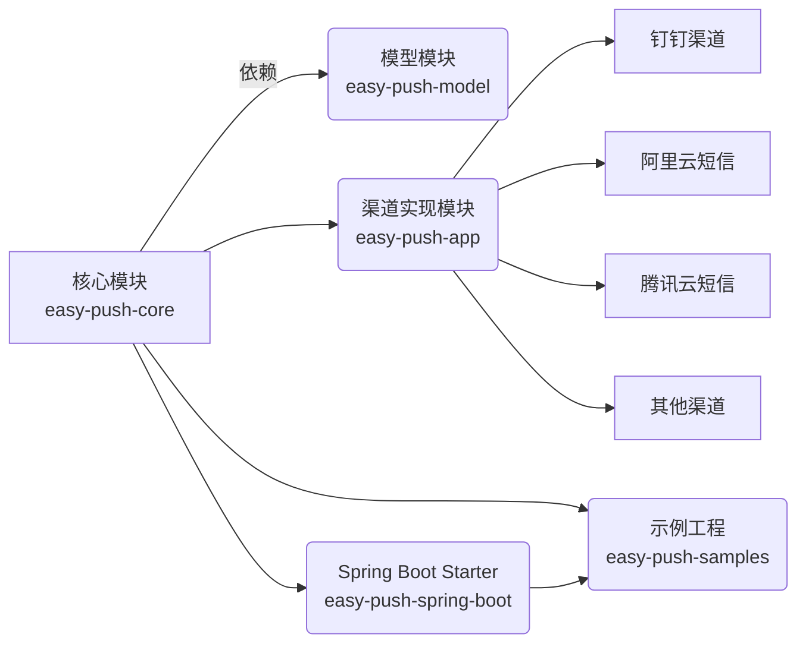
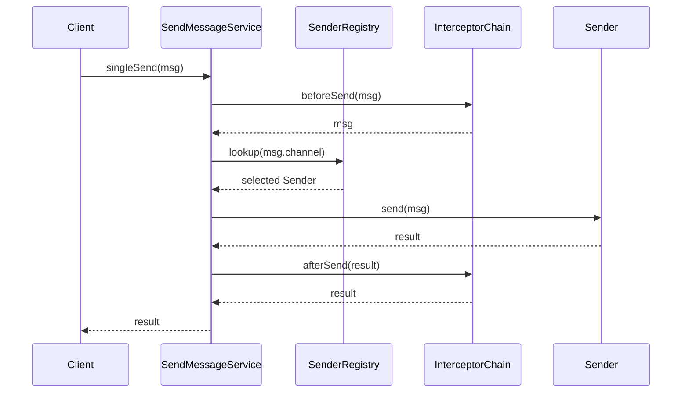
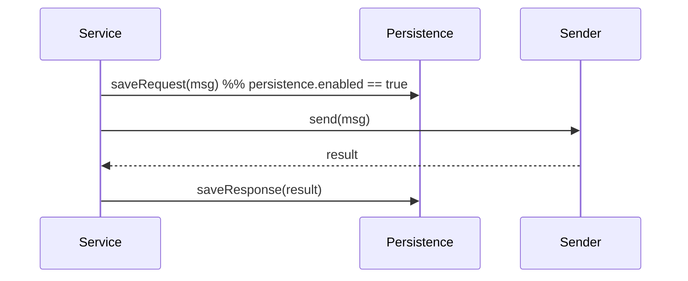
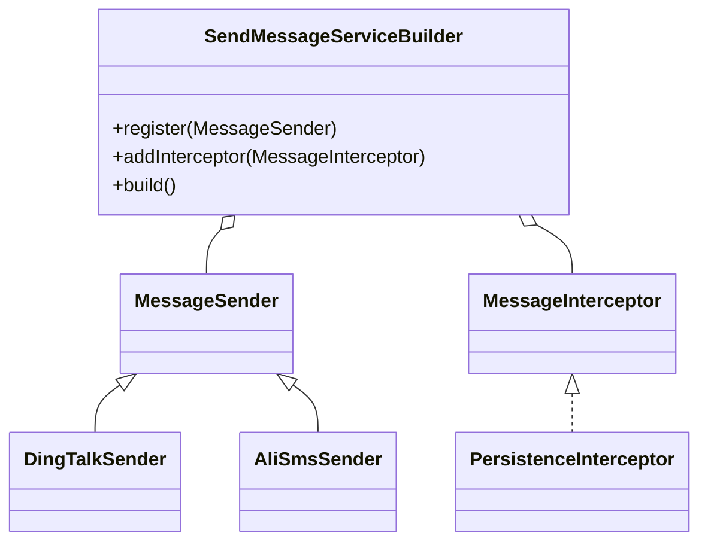
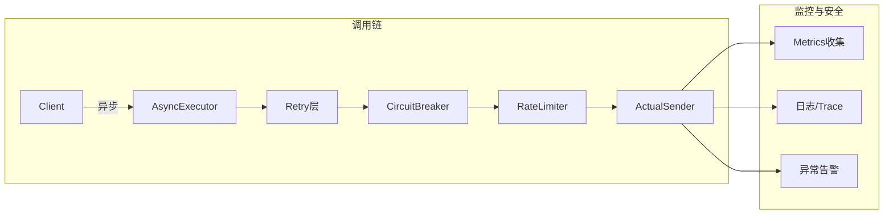

项目: easy-push (JavaSE 与 Spring Boot 双生态兼容消息推送框架)

# 系统顶层设计

## 1. 模块划分与职责



- **easy-push-core**：零依赖，提供 `MessageSender`、`SendMessageService`、`SendMessageServiceBuilder` 和核心分发逻辑。
- **easy-push-model**：定义通用消息结构 `Message` 及基础配置类 `ConfigProperties`。
- **easy-push-app**：各渠道 `MessageSender` 实现和对应 `*Properties`。
- **easy-push-spring-boot**：基于 Spring Boot 自动装配，读取 `application.yml`，按需注入 Sender 和持久化组件。
- **easy-push-samples**：包含纯 JavaSE 和 Spring Boot 两套使用示例。

------

## 2. 核心流程



- **拦截器链**：支持 `beforeSend`、`afterSend`、`onError` 扩展。
- **注册中心**：维护 channel → sender 映射，支持手动注册、SPI 自动扫描、Spring 自动装配。

------

## 3. 默认能力（可选持久化）



- 在 `EasyPushProperties.persistence` 中配置 `enabled/type`。
- 持久化模块独立为 `easy-push-persistence`，支持 MySQL、Redis 等。
- 通过 `@ConditionalOnProperty` 或 SPI 注册 `PersistenceService`。

------

## 4. 扩展点与自定义



- **JavaSE**：通过 `SendMessageServiceBuilder.register()` 或 SPI 自动加载。
- **Spring**：`@ConditionalOnMissingBean` 覆盖默认，`@EventListener` 或 Spring 事件扩展。

------

## 5. 性能、高并发与安全稳定



- **异步+线程池**：Spring `@Async` / Disruptor。
- **Resilience4j**：`@Retry`、`@CircuitBreaker`、`@RateLimiter`。
- **连接池与批量**：HttpClient/OkHttp 连接池，批量拆分。
- **监控告警**：Micrometer + Prometheus + Alertmanager。
- **安全加固**：Vault/KMS 配置加密，TraceId 贯穿日志与指标。


## 6.扩展

### 6.1 为什么采用职责链？如何快速接入大量渠道？

- **隔离解耦**
   职责链模式（Chain of Responsibility）能把每个渠道的实现完全隔离，链上的每个节点只关心自己那一段逻辑，不会互相干扰。
- **按需插拔**
   当需要新增或停用某个渠道时，只需在链中添加/移除对应的 `ChannelHandler` 节点，无需修改核心分发逻辑，开发和测试成本低。
- **快速开发**
   每个渠道实现都遵循同一接口（节点规范），工程师只需照搬已有模板，少量配置即可完成新渠道接入。

**落地方案**：

- 在新架构中，用策略模式（`MessageSender` 接口 + 注册中心）保留这种“按 channel 动态分发”的能力；
- 同时提供 SPI 自动发现或 Spring 条件装配，新增渠道时只要添加模块和实现类，无需改动核心代码。

------

### 6.2 如何提供默认能力（可选持久化到 MySQL）？

- **配置驱动**
   在 `EasyPushProperties` 中增加如下属性：

  ```
  yaml复制编辑easy-push:
    persistence:
      enabled: true
      type: mysql     # 支持 mysql、redis、kafka 等
      mysql:
        url: jdbc:...
        username: ...
        password: ...
  ```

- **模块化持久化组件**

  - 创建一个 `easy-push-persistence` 子模块，内部提供 MySQL 实现（基于 Spring JDBC / Mybatis）、Redis 实现等。
  - 在核心或 Spring Boot Starter 中，用 `@ConditionalOnProperty(prefix="easy-push.persistence", name="enabled", havingValue="true")` 注入对应的 `PersistenceService`。

- **拦截器链**
   在发送前/后环节内置默认拦截器（`PersistenceInterceptor`），将消息记录到数据库；用户可通过配置决定是否启用。

------

### 6.3 如何在各环节提供自定义化扩展？

- **Builder 注册阶段**
   JavaSE 场景下，`SendMessageServiceBuilder` 提供：

  ```
  builder.register(customSender);
  builder.addInterceptor(customInterceptor);
  ```

- **SPI 扩展点**
   在 `META-INF/services` 目录下定义：

  - `MessageSender`：可让用户打包自己的渠道实现 jar，自动发现并注册；
  - `MessageInterceptor`：让用户实现自定义拦截逻辑（如审计、二次路由等）。

- **Spring Bean 覆盖**
   Spring Boot 场景，用：

  ```
  @Bean
  @ConditionalOnMissingBean(MessageSender.class)
  public MessageSender userDefinedSender() { … }
  ```

- **事件监听**
   在核心发送流程中发布 Spring 事件（`MessageSentEvent`、`MessageFailedEvent`），用户可实现 `ApplicationListener` 注册自定义回调。

------

### 6.4 如何确保高性能、高并发、安全稳定？

1. **异步非阻塞**
   - 用 `@Async` 或自定义线程池，把网络 I/O 操作和持久化操作放到独立线程；
   - 对 JavaSE 场景可提供基于 [Disruptor](https://github.com/LMAX-Exchange/disruptor) 的无锁队列。
2. **限流与熔断**
   - 集成 Resilience4j，给每个渠道打上 `retry`（带指数退避）、`circuitBreaker`、`rateLimiter` 注解；
   - 避免某个渠道雪崩时连带影响其他渠道。
3. **连接池与批量**
   - 对 HTTP 客户端使用连接池（Apache HttpClient、OkHttp）；
   - 对支持批量发送的渠道，提供批量接口并智能拆分请求。
4. **监控与告警**
   - 集成 Micrometer，输出每个渠道的 QPS、延迟、错误率；
   - 将指标暴露给 Prometheus，配合 Alertmanager 做报警。
5. **安全加固**
   - 配置加密：对敏感配置（token、secret）使用 Vault、KMS 或 Spring Cloud Config 加密存储；
   - 链路追踪：自动在日志与监控指标中携带 TraceId，便于故障定位；
   - 输入校验：对所有外部参数、消息内容做严格校验，防止注入攻击或恶意数据。

------

